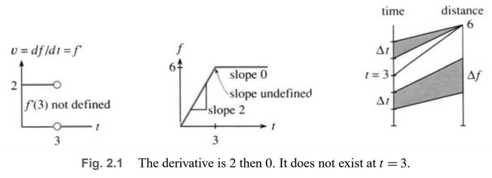
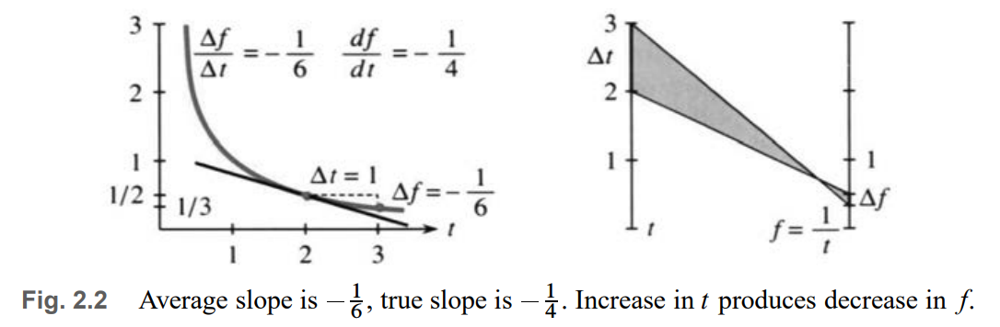
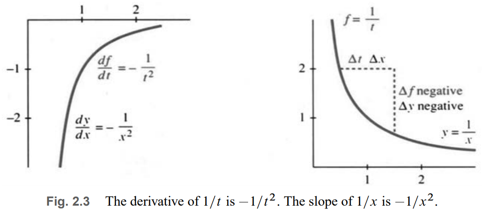

# 📚 Section 2.1: The Derivative of a Function

> **The derivative is the instantaneous rate of change — defined as a limit of average rates.**

## 🧮 Definition of the Derivative

Let $ f(t) $ be a function of time $ t $.  
The **derivative** of $ f $ at time $ t $ is:

$$
f'(t) = \frac{df}{dt} = \lim_{\Delta t \to 0} \frac{f(t + \Delta t) - f(t)}{\Delta t}
$$

✅ **What this means**:
- $ \Delta t $: small time step (positive or negative)
- $ \Delta f = f(t + \Delta t) - f(t) $: change in distance
- $ \frac{\Delta f}{\Delta t} $: average velocity over interval $ \Delta t $
- $ \lim_{\Delta t \to 0} $: take the limit → get **instantaneous velocity**

> 💡 **Leibniz notation**: $ \frac{df}{dt} $ suggests “small change in f divided by small change in t”  
> **Newton notation**: $ f'(t) $ or $ \dot{f}(t) $

---

## 🔍 Step-by-Step Breakdown

### Example: $ f(t) = t^2 $

Compute $ \frac{\Delta f}{\Delta t} $:
$$
\frac{f(t + \Delta t) - f(t)}{\Delta t} = \frac{(t + \Delta t)^2 - t^2}{\Delta t} = \frac{t^2 + 2t\Delta t + (\Delta t)^2 - t^2}{\Delta t} = 2t + \Delta t
$$

Now take the limit:
$$
f'(t) = \lim_{\Delta t \to 0} (2t + \Delta t) = 2t
$$

✅ **Key insight**:  
- Don’t set $ \Delta t = 0 $ too early — you get $ 0/0 $!  
- First simplify algebraically, then take limit.

---

## 📈 Examples

### Example 1: Constant Velocity ($ f(t) = Vt $)

$$
\frac{\Delta f}{\Delta t} = \frac{V(t + \Delta t) - Vt}{\Delta t} = \frac{V\Delta t}{\Delta t} = V
\Rightarrow f'(t) = V
$$

✅ So:  
- Derivative of $ Vt $ is $ V $  
- Derivative of $ 2t $ is $ 2 $

---

### Example 2: Piecewise Function — Stop at $ t = 3 $

$$
f(t) = 
\begin{cases}
2t & \text{if } t \leq 3 \\
6 & \text{if } t > 3
\end{cases}
$$

- For $ t < 3 $: $ f'(t) = 2 $  
- For $ t > 3 $: $ f'(t) = 0 $ (constant → slope = 0)  
- At $ t = 3 $: **Derivative does not exist** — corner point!

> ⚠️ Why? Left-hand limit: average velocity before $ t=3 $ → 2  
> Right-hand limit: average velocity after $ t=3 $ → 0  
> Not equal → no derivative at $ t=3 $

---

### Example 3: $ f(t) = \frac{1}{t} $ (Demand Function)

Compute $ \Delta f $:
$$
\Delta f = f(t + \Delta t) - f(t) = \frac{1}{t + \Delta t} - \frac{1}{t} = \frac{t - (t + \Delta t)}{t(t + \Delta t)} = \frac{-\Delta t}{t(t + \Delta t)}
$$

Divide by $ \Delta t $:
$$
\frac{\Delta f}{\Delta t} = \frac{-1}{t(t + \Delta t)}
$$

Take limit:
$$
f'(t) = \lim_{\Delta t \to 0} \frac{-1}{t(t + \Delta t)} = \frac{-1}{t^2}
$$

✅ So:  
- Derivative of $ \frac{1}{t} $ is $ -\frac{1}{t^2} $  
- Negative → function is decreasing  
- Large negative slope for small $ t $ → demand drops sharply when price is low

---

## 🔄 Generalizing to x instead of t

We often use $ x $ as independent variable (position, not time).

Let $ y = f(x) $. Then:
$$
\frac{dy}{dx} = \lim_{\Delta x \to 0} \frac{f(x + \Delta x) - f(x)}{\Delta x}
$$

✅ Same idea — just different letters.

Examples:
- $ y = x^2 \Rightarrow \frac{dy}{dx} = 2x $
- $ y = \frac{1}{x} \Rightarrow \frac{dy}{dx} = -\frac{1}{x^2} $

---

## 📌 Notation Summary

| Symbol | Meaning | Pronounced |
|--------|---------|----------|
| $ f(t) $ | value of function at time $ t $ | “f of t” |
| $ \Delta t $ | small time step | “delta t” |
| $ f(t + \Delta t) $ | value at $ t + \Delta t $ | “f of t plus delta t” |
| $ \Delta f $ | change in f | “delta f” |
| $ \frac{\Delta f}{\Delta t} $ | average velocity | “delta f over delta t” |
| $ f'(t) $ | derivative at $ t $ | “f prime of t” |
| $ \frac{df}{dt} $ | same as $ f'(t) $ | “d f d t” |
| $ \lim_{\Delta t \to 0} $ | limit as $ \Delta t $ → 0 | “limit as delta t goes to zero” |

> 💡 **Important**:  
> - $ \Delta f $ ≠ $ \Delta \times f $ — it’s the *change* in $ f $  
> - $ \frac{df}{dt} $ is a single symbol — don’t cancel $ d $ or $ \Delta $

---

## 🧩 Chain Rule Preview: Derivative of $ [u(x)]^2 $

Let $ f(x) = [u(x)]^2 $. What is $ f'(x) $?

Start with:
$$
\Delta f = [u(x + \Delta x)]^2 - [u(x)]^2 = [u(x + \Delta x) + u(x)] \cdot [u(x + \Delta x) - u(x)]
$$

Divide by $ \Delta x $:
$$
\frac{\Delta f}{\Delta x} = [u(x + \Delta x) + u(x)] \cdot \left[ \frac{u(x + \Delta x) - u(x)}{\Delta x} \right]
$$

Take limit:
$$
f'(x) = 2u(x) \cdot u'(x)
$$

✅ **Square Rule**:  
> The derivative of $ [u(x)]^2 $ is $ 2u(x) \cdot u'(x) $

### Examples:

- $ u(x) = x^2 \Rightarrow f(x) = x^4 \Rightarrow f'(x) = 2(x^2)(2x) = 4x^3 $
- $ u(x) = \frac{1}{x} \Rightarrow f(x) = \frac{1}{x^2} \Rightarrow f'(x) = 2(\frac{1}{x})(-\frac{1}{x^2}) = -\frac{2}{x^3} $
- $ u(x) = \sin x \Rightarrow f(x) = \sin^2 x \Rightarrow f'(x) = 2\sin x \cos x $

---

## ✅ Summary: Key Ideas

| Concept | Formula | Meaning |
|--------|--------|--------|
| **Average velocity** | $ \frac{f(t + \Delta t) - f(t)}{\Delta t} $ | Slope of secant line |
| **Instantaneous velocity** | $ f'(t) = \lim_{\Delta t \to 0} \frac{\Delta f}{\Delta t} $ | Slope of tangent line |
| **Constant function** | $ f(t) = C \Rightarrow f'(t) = 0 $ | Flat graph → zero slope |
| **Linear function** | $ f(t) = Vt \Rightarrow f'(t) = V $ | Constant slope |
| **Quadratic** | $ f(t) = t^2 \Rightarrow f'(t) = 2t $ | Slope increases linearly |
| **Reciprocal** | $ f(t) = \frac{1}{t} \Rightarrow f'(t) = -\frac{1}{t^2} $ | Decreasing, steep near zero |
| **Chain rule preview** | $ \frac{d}{dx}[u(x)]^2 = 2u(x)u'(x) $ | Derivative of square |

> **Calculus is about change — and the derivative measures how fast something changes at an instant.**
