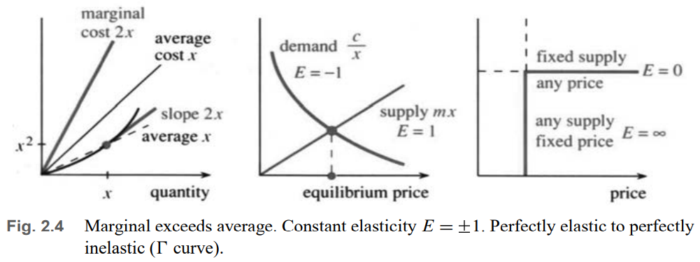

# 📚 Section 2.2: Powers and Polynomials

> **The derivative of $ x^n $ is $ nx^{n-1} $ — the most useful rule in calculus.**

## 🔢 Derivative of Powers: $ f(x) = x^n $

We begin with **positive integers** $ n $, then extend to **all real exponents**.

### Example: $ f(x) = x^3 $
Compute the derivative using the limit definition:
$$
\Delta f = f(x + h) - f(x) = (x + h)^3 - x^3 = x^3 + 3x^2h + 3xh^2 + h^3 - x^3
$$
$$
\frac{\Delta f}{h} = 3x^2 + 3xh + h^2 \quad \xrightarrow{h \to 0} \quad f'(x) = 3x^2
$$

✅ **Pattern**:  
- $ x^2 \to 2x $  
- $ x^3 \to 3x^2 $  
- $ x^4 \to 4x^3 $

---

## 📐 General Rule: Power Rule

> **The derivative of $ x^n $ is $ nx^{n-1} $**  
> for any real number $ n $ (integer, fraction, negative, irrational).

### Binomial Expansion (for integer $ n $):
$$
(x + h)^n = x^n + nx^{n-1}h + \binom{n}{2}x^{n-2}h^2 + \cdots + h^n
$$
Subtract $ x^n $, divide by $ h $:
$$
\frac{(x + h)^n - x^n}{h} = nx^{n-1} + \binom{n}{2}x^{n-2}h + \cdots + h^{n-1}
$$
Take limit $ h \to 0 $: all terms with $ h $ vanish → only **$ nx^{n-1} $** remains.

✅ **Pascal’s Triangle** gives binomial coefficients:
```
n=0:        1
n=1:      1   1
n=2:    1   2   1
n=3:  1   3   3   1
n=4: 1   4   6   4   1
```

[FIG Pascal: Triangle showing coefficients for (x+h)^n up to n=4]

---

## 📈 Power Rule for All Exponents

The rule $ \frac{d}{dx}(x^n) = nx^{n-1} $ works even when $ n $ is **not** an integer:

| Function $ f(x) $ | Derivative $ f'(x) $ |
|--------------------|------------------------|
| $ x^{10} $       | $ 10x^9 $            |
| $ x^{2.2} $      | $ 2.2x^{1.2} $       |
| $ x^{-1} = \frac{1}{x} $ | $ -x^{-2} = -\frac{1}{x^2} $ |
| $ x^{-2} = \frac{1}{x^2} $ | $ -2x^{-3} = -\frac{2}{x^3} $ |
| $ x^{1/2} = \sqrt{x} $ | $ \frac{1}{2}x^{-1/2} = \frac{1}{2\sqrt{x}} $ |
| $ x^{-1/2} = \frac{1}{\sqrt{x}} $ | $ -\frac{1}{2}x^{-3/2} = -\frac{1}{2x\sqrt{x}} $ |

> 💡 **Key idea**: Bring down the exponent, reduce power by 1.

---

## ➕➖ Derivatives of Polynomials

A **polynomial** is a sum of power functions:
$$
f(x) = a_nx^n + a_{n-1}x^{n-1} + \cdots + a_1x + a_0
$$

### Two Key Rules:

1. **Constant Multiple Rule**:  
   $$
   \frac{d}{dx}[c \cdot f(x)] = c \cdot f'(x)
   $$

2. **Sum Rule**:  
   $$
   \frac{d}{dx}[f(x) + g(x)] = f'(x) + g'(x)
   $$

✅ **Derivative of any polynomial**: Differentiate term by term.

### Examples:

- $ f(x) = 9 + 2x - x^5 $  
  $ f'(x) = 0 + 2 - 5x^4 = 2 - 5x^4 $

- $ f(x) = 6x^3 + \frac{1}{2}x^2 $  
  $ f'(x) = 18x^2 + x $

- $ f(x) = 6x^3 - \frac{1}{2}x^2 $  
  $ f'(x) = 18x^2 - x $

> ⚠️ **Derivative of a constant is zero** → constants disappear in differentiation (but reappear in integration!).

[FIG Polynomial: Graph of f(x) = x^3 - 3x + 2 and its derivative f'(x) = 3x^2 - 3]

---

## 🔁 Differential Equations: Reverse Process

Given **derivative**, find **function**.

### Example:
- If $ \frac{dy}{dx} = 3x^2 $, then $ y = x^3 + C $
- If $ \frac{dy}{dx} = 2x + 1 $, then $ y = x^2 + x + C $

> 💡 **Constant $ C $** = unknown starting value (e.g., initial position)

### Real-World Example: AIDS Epidemic (1989)
- Data fit **cubic polynomial**:  
  $$
  y = 174.6(t - 1981.2)^3 + 340
  $$
- Derivative: $ \frac{dy}{dt} = 3 \cdot 174.6(t - 1981.2)^2 $
- Not exponential $ (e^t) $, but **cubic growth** → suggests different dynamics

✅ **Differential equations mix $ y $ and $ \frac{dy}{dx} $**:
- $ \frac{dy}{dx} = 3y/x $ → solved by $ y = x^3 $
- $ \frac{dy}{dx} = 3y^{2/3} $ → also solved by $ y = x^3 $

---

## 💰 Economics: Marginal Cost & Elasticity

### Marginal Cost
- **Average cost** = total cost / quantity → describes past  
- **Marginal cost** = derivative of cost → predicts future

Example:  
- Cost = $ x^2 $ → Average cost = $ x $, Marginal cost = $ 2x $
- Marginal > Average → increasing returns

[FIG 2.4: Graph showing marginal cost curve above average cost curve]

---

### Elasticity of Demand

Measures **relative change** (percentage), independent of units.

**Definition**:  
$$
E(x) = \frac{dy/dx}{y/x} = \left( \frac{dy}{dx} \right) \cdot \left( \frac{x}{y} \right)
$$

- $ E = $ (marginal) / (average)
- Dimensionless → same in dollars or pesos

#### Interpretation:
- $ |E| > 1 $: **Elastic** → demand sensitive to price
- $ |E| < 1 $: **Inelastic** → demand not sensitive
- $ E = -1 $: **Unit elastic** (spending = constant)

---

### Example 4: $ y = \frac{c}{x} $ (Demand)
- $ \frac{dy}{dx} = -\frac{c}{x^2} $
- $ \frac{y}{x} = \frac{c}{x^2} $
- Elasticity:  
  $$
  E = \frac{-c/x^2}{c/x^2} = -1
  $$

✅ **Constant spending**: $ x \cdot y = c $

---

### Power Functions & Constant Elasticity

If $ y = c x^n $, then:
$$
\frac{dy}{dx} = c n x^{n-1}, \quad \frac{y}{x} = c x^{n-1}
\Rightarrow E = \frac{c n x^{n-1}}{c x^{n-1}} = n
$$

✅ **Power functions have constant elasticity = exponent**

| Function | Elasticity |
|---------|-----------|
| $ y = \frac{1}{x} = x^{-1} $ | $ E = -1 $ |
| $ y = \frac{1}{\sqrt{x}} = x^{-1/2} $ | $ E = -1/2 $ (inelastic) |
| $ y = \frac{1}{x^3} = x^{-3} $ | $ E = -3 $ (elastic) |

---

### Supply Elasticity

- **Supply**: $ y = cx $ → $ E = 1 $
- **Perfectly inelastic**: $ y = c $ (fixed supply) → $ E = 0 $
- **Perfectly elastic**: horizontal supply → $ E = \infty $



---

### Income Elasticity

Measures how demand changes with income:
$$
E = \frac{dy/dI}{y/I}
$$

- **Luxury**: $ E > 1 $ → demand grows faster than income
- **Necessity**: $ E < 1 $ → demand grows slower

#### Example: Savings
- Income = \$10,000 → Savings = \$500
- Income elasticity $ E = 2 $
- So savings = $ y = cI^2 $
- Solve: $ 500 = c(10{,}000)^2 \Rightarrow c = 5 \times 10^{-6} $
- Marginal savings = $ \frac{dy}{dI} = 2cI = 10 \times 10^{-6} \times 10^4 = 0.1 $
- **Save 10¢ of next dollar** (marginal), even though average is 5%

---

## ✅ Summary: Key Rules

| Rule | Formula |
|------|--------|
| **Power Rule** | $ \frac{d}{dx}(x^n) = nx^{n-1} $ |
| **Constant Multiple** | $ \frac{d}{dx}[cf(x)] = c f'(x) $ |
| **Sum Rule** | $ \frac{d}{dx}[f(x) + g(x)] = f'(x) + g'(x) $ |
| **Elasticity** | $ E = \frac{dy/dx}{y/x} $ |
| **Power Function Elasticity** | $ y = cx^n \Rightarrow E = n $ |

> **Polynomials are easy to differentiate — and appear everywhere in science and economics.**
