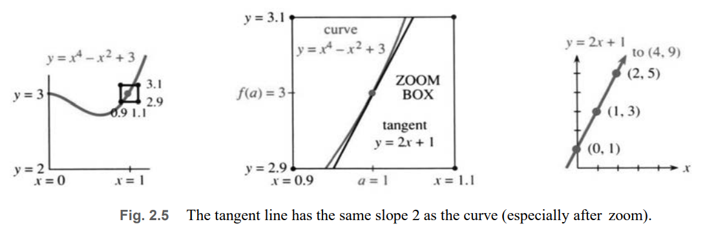
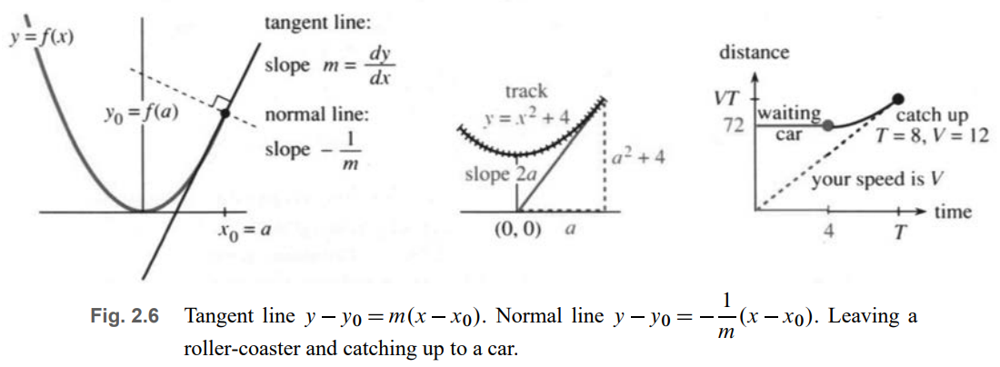
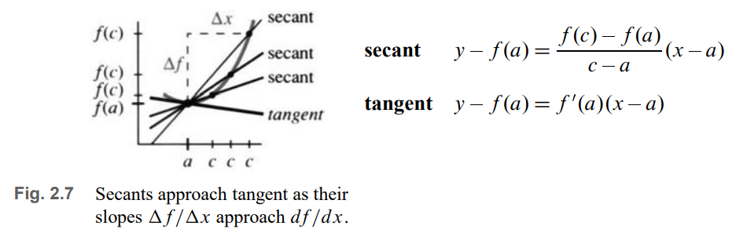

# 📚 Section 2.3: The Slope and the Tangent Line

> **At any point on a curve, the tangent line is the straight line that best approximates the curve — sharing the same slope.**

## 🔍 Why Tangent Lines?

Most functions are **curved**, not straight. But **near a single point**, a curve looks **almost linear**.

- Zoom in → curve appears straight
- The **slope** of this "almost straight" line = **instantaneous rate of change**
- This line is the **tangent line**

✅ **Goal**: Find the **equation** of the tangent line at any point $ x = a $.

---

## 📐 Equation of the Tangent Line

Given a function $ y = f(x) $, at point $ x = a $:

- Point on curve: $ (a, f(a)) $
- Slope of tangent: $ m = f'(a) $

### Point-Slope Form:
$$
y - f(a) = f'(a)(x - a)
$$

This is the **best linear approximation** to $ f(x) $ near $ x = a $.

---

## 📘 Example 1: $ f(x) = x^4 - x^2 + 3 $ at $ x = 1 $

1. **Point**: $ f(1) = 1 - 1 + 3 = 3 $ → $ (1, 3) $
2. **Derivative**: $ f'(x) = 4x^3 - 2x $
3. **Slope**: $ f'(1) = 4 - 2 = 2 $
4. **Tangent line**:
   $$
   y - 3 = 2(x - 1)
   $$

✅ This line touches the curve at $ x = 1 $ and matches its slope.

---

## 🧮 Deriving the Tangent Line Equation

### General Form of a Line: $ y = mx + b $
- $ m $ = slope
- $ b $ = y-intercept

For the **tangent line**:
- Must pass through $ (a, f(a)) $
- Must have slope $ m = f'(a) $

So:
$$
f(a) = f'(a) \cdot a + b \quad \Rightarrow \quad b = f(a) - f'(a) \cdot a
$$

Substitute back:
$$
y = f'(a)x + f(a) - f'(a)a = f(a) + f'(a)(x - a)
$$

✅ Same as point-slope form.

---

## 📏 Example 2: $ f(x) = x^3 - 2 $ at $ x = 2 $

1. **Point**: $ f(2) = 8 - 2 = 6 $ → $ (2, 6) $
2. **Slope**: $ f'(x) = 3x^2 \Rightarrow f'(2) = 12 $
3. **Tangent line**:
   $$
   y - 6 = 12(x - 2) \quad \text{or} \quad y = 12x - 18
   $$

---

## 📐 Normal Line: Perpendicular to Tangent

- **Normal line** is perpendicular to tangent
- If tangent slope = $ m $, then **normal slope = $ -1/m $**

For Example 2:
- Tangent: $ y - 6 = 12(x - 2) $
- Normal: $ y - 6 = -\frac{1}{12}(x - 2) $

✅ Used in optics (light rays), fire spread, and engineering.

---

## 🎢 Example 3: Roller-Coaster Problem

You’re on track $ y = x^2 + 4 $. You want to jump off and land at origin $ (0,0) $.  
Where to step off?

Let jump point = $ x = a $:
- Height = $ a^2 + 4 $
- Slope = $ 2a $
- Tangent line: $ y - (a^2 + 4) = 2a(x - a) $

Require it passes through $ (0,0) $:
$$
0 - (a^2 + 4) = 2a(0 - a) \Rightarrow -a^2 - 4 = -2a^2 \Rightarrow a^2 = 4 \Rightarrow a = \pm 2
$$

✅ Step off at $ x = 2 $ or $ x = -2 $.

---

## 🚦 Example 4: Traffic Light Problem

- Red light **72 m** ahead
- Turns green in **4 seconds**
- Car ahead accelerates at **3 m/s²** after light turns green
- You want to **just catch up** without passing

Let your constant speed = $ V $, catch-up time = $ T $

1. **Speed match**: $ V = 3(T - 4) \Rightarrow T = \frac{V}{3} + 4 $
2. **Distance match**:  
   Your distance = $ V T $  
   Their distance = $ 72 + \frac{1}{2} \cdot 3 \cdot (T - 4)^2 $

Substitute:
$$
VT = 72 + \frac{3}{2} \left( \frac{V}{3} \right)^2 = 72 + \frac{V^2}{6}
$$
$$
V\left( \frac{V}{3} + 4 \right) = 72 + \frac{V^2}{6}
\Rightarrow \frac{V^2}{3} + 4V = 72 + \frac{V^2}{6}
\Rightarrow \frac{V^2}{6} + 4V - 72 = 0
$$

Multiply by 6:
$$
V^2 + 24V - 432 = 0 \Rightarrow V = 12 \text{ m/s} \quad (\text{≈ 27 mph})
$$

✅ Without the car ahead, you’d go 18 m/s — but **calculus optimizes traffic flow**.

---

## 📐 Secant Line: Connecting Two Points

The **secant line** connects two points on a curve:  
- $ (a, f(a)) $ and $ (c, f(c)) $

### Slope of secant:
$$
m = \frac{f(c) - f(a)}{c - a}
$$

### Equation:
$$
y - f(a) = \left( \frac{f(c) - f(a)}{c - a} \right)(x - a)
$$

This is the **average slope** between $ a $ and $ c $.

---

### Example 5: $ f(x) = x^3 - 2 $, from $ x=2 $ to $ x=3 $

- $ f(2) = 6 $, $ f(3) = 25 $
- Slope = $ \frac{25 - 6}{3 - 2} = 19 $
- Secant line: $ y - 6 = 19(x - 2) $

✅ Passes through both points.

---

## 🔁 Secant → Tangent: The Limit

As $ c \to a $, the secant line approaches the tangent line:

$$
f'(a) = \lim_{c \to a} \frac{f(c) - f(a)}{c - a}
$$

This is **equivalent** to:
$$
f'(x) = \lim_{h \to 0} \frac{f(x + h) - f(x)}{h}
$$

✅ **Differential calculus in one idea**:  
> **Tangent slope = limit of secant slopes**

---

## 📈 Example 6: $ f(x) = \sin x $ at $ x = 0 $

- Point: $ (0, 0) $
- Secant slope from 0 to $ c $: $ \frac{\sin c - 0}{c - 0} = \frac{\sin c}{c} $
- Secant line: $ y = \left( \frac{\sin c}{c} \right) x $
- As $ c \to 0 $, $ \frac{\sin c}{c} \to 1 $
- **Tangent line**: $ y = x $

✅ Derivative of $ \sin x $ at 0 is 1.

---

## 💰 Example 7: Gold Investment

Gold worth $ y = \sqrt{t} $ million dollars in $ t $ years.

**When to sell?** When growth rate = **10% of current value**.

1. **Growth rate** = derivative = $ \frac{dy}{dt} = \frac{1}{2\sqrt{t}} $
2. **10% of value** = $ 0.1 \sqrt{t} $
3. Set equal:
   $$
   \frac{1}{2\sqrt{t}} = \frac{\sqrt{t}}{10} \Rightarrow 2t = 10 \Rightarrow t = 5
   $$

At $ t = 5 $:
- Value = $ \sqrt{5} $
- Slope = $ \frac{\sqrt{5}}{10} $
- **Tangent line** (bond with simple interest):
  $$
  y - \sqrt{5} = \frac{\sqrt{5}}{10}(t - 5)
  $$
- At $ t = 25 $:  
  $ y = \sqrt{5} + \frac{\sqrt{5}}{10}(20) = \sqrt{5} + 2\sqrt{5} = 3\sqrt{5} \approx 6.7 \text{ million} $

Gold alone would be only $ \sqrt{25} = 5 $ million.

✅ **Tangent line beats the curve** after $ t = 5 $ — sell and invest!

---

## ✅ Summary: Key Formulas

| Concept | Formula |
|--------|--------|
| **Tangent line** | $ y - f(a) = f'(a)(x - a) $ |
| **Normal line** | $ y - f(a) = -\frac{1}{f'(a)}(x - a) $ |
| **Secant line** | $ y - f(a) = \frac{f(c) - f(a)}{c - a}(x - a) $ |
| **Derivative (limit)** | $ f'(a) = \lim_{c \to a} \frac{f(c) - f(a)}{c - a} $ |

> **The tangent line is the bridge between straight-line intuition and curved reality.**