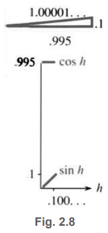
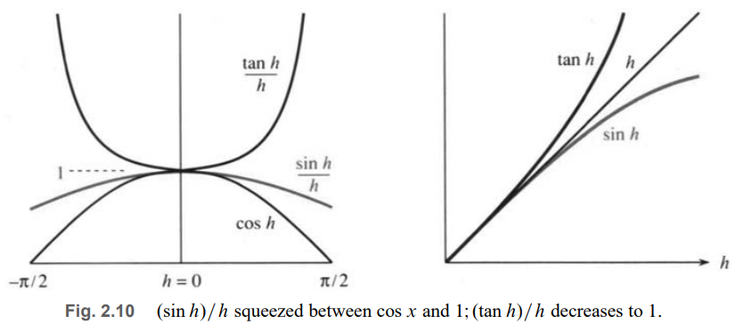
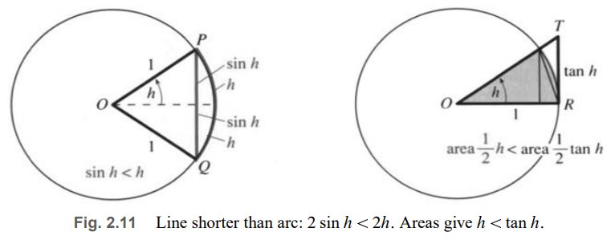
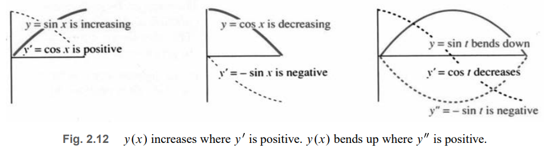
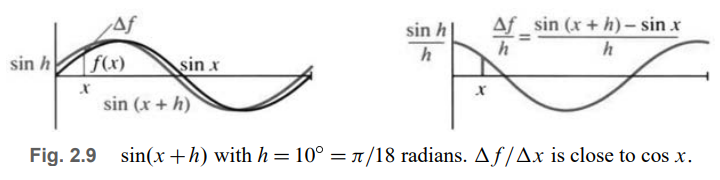

# 📚 Section 2.4: The Derivative of the Sine and Cosine

> **The derivative of $ \sin x $ is $ \cos x $, and the derivative of $ \cos x $ is $ -\sin x $.  
> These functions describe the most fundamental oscillations in nature.**

## 🔁 The Derivative of $ \sin x $

We compute the derivative using the **limit definition**:

$$
\frac{d}{dx}(\sin x) = \lim_{h \to 0} \frac{\sin(x + h) - \sin x}{h}
$$

Use the **addition formula** (from trigonometry):
$$
\sin(x + h) = \sin x \cos h + \cos x \sin h
$$

Substitute:
$$
\frac{\Delta y}{\Delta x} = \frac{\sin x \cos h + \cos x \sin h - \sin x}{h} = \sin x \left( \frac{\cos h - 1}{h} \right) + \cos x \left( \frac{\sin h}{h} \right)
$$

Now take the limit as $ h \to 0 $. Two **key limits** are needed:

$$
\lim_{h \to 0} \frac{\cos h - 1}{h} = 0 \quad \text{and} \quad \lim_{h \to 0} \frac{\sin h}{h} = 1
$$

Therefore:
$$
\frac{d}{dx}(\sin x) = \sin x \cdot 0 + \cos x \cdot 1 = \cos x
$$

✅ **Result**:  
> **The derivative of $ \sin x $ is $ \cos x $**.

---

## 🔍 Why Are These Limits True?

### 1. $ \lim_{h \to 0} \frac{\sin h}{h} = 1 $

For small $ h > 0 $ (in **radians**), geometry gives:
$$
\sin h < h < \tan h
$$

Divide by $ \sin h $ (positive):
$$
1 < \frac{h}{\sin h} < \frac{1}{\cos h} \quad \Rightarrow \quad \cos h < \frac{\sin h}{h} < 1
$$

As $ h \to 0 $, $ \cos h \to 1 $, so by the **Squeeze Theorem**:
$$
\frac{\sin h}{h} \to 1
$$

> 📌 **Critical**: This only works when $ h $ is in **radians**. In degrees, the limit is $ \frac{\pi}{180} \neq 1 $.

---

### 2. $ \lim_{h \to 0} \frac{\cos h - 1}{h} = 0 $

Use the identity:
$$
(\cos h - 1)(\cos h + 1) = \cos^2 h - 1 = -\sin^2 h
\Rightarrow \cos h - 1 = -\frac{\sin^2 h}{\cos h + 1}
$$

So:
$$
\frac{\cos h - 1}{h} = -\frac{\sin^2 h}{h(\cos h + 1)} = -\left( \frac{\sin h}{h} \right) \left( \frac{\sin h}{\cos h + 1} \right)
$$

As $ h \to 0 $:
- $ \frac{\sin h}{h} \to 1 $
- $ \sin h \to 0 $
- $ \cos h + 1 \to 2 $

So the whole expression → $ -(1)(0/2) = 0 $

✅ Confirmed.

> 💡 **Approximation**: $ 1 - \cos h \approx \frac{1}{2}h^2 $ for small $ h $

---

## 📉 The Derivative of $ \cos x $

Use the same method:

$$
\frac{d}{dx}(\cos x) = \lim_{h \to 0} \frac{\cos(x + h) - \cos x}{h}
$$

Addition formula:
$$
\cos(x + h) = \cos x \cos h - \sin x \sin h
$$

So:
$$
\frac{\Delta y}{\Delta x} = \cos x \left( \frac{\cos h - 1}{h} \right) - \sin x \left( \frac{\sin h}{h} \right)
\xrightarrow{h \to 0} \cos x \cdot 0 - \sin x \cdot 1 = -\sin x
$$

✅ **Result**:  
> **The derivative of $ \cos x $ is $ -\sin x $**.

---

## 📈 Geometric Interpretation

- When $ \sin x $ is **increasing** (e.g., near $ x = 0 $), its derivative $ \cos x > 0 $
- At **maximum** ($ x = \pi/2 $), $ \sin x = 1 $, slope = $ \cos(\pi/2) = 0 $
- When **decreasing** ($ x = \pi $), slope = $ \cos \pi = -1 $

Similarly for $ \cos x $:
- Starts at 1, slope = 0
- Decreases → slope negative
- Minimum at $ x = \pi $, slope = 0 again

✅ **Sign of derivative** tells whether function is rising or falling.

---

## 🔄 Second Derivatives and Oscillation

The **second derivative** is the derivative of the derivative:
$$
\frac{d^2y}{dx^2} = \frac{d}{dx}\left( \frac{dy}{dx} \right)
$$

### For sine and cosine:

- $ y = \sin x $  
  $ y' = \cos x $  
  $ y'' = -\sin x = -y $

- $ y = \cos x $  
  $ y' = -\sin x $  
  $ y'' = -\cos x = -y $

✅ **Both satisfy the differential equation**:
$$
\frac{d^2y}{dx^2} = -y
$$

This is the equation of **simple harmonic motion**.

> 💡 **Physical meaning**:  
> - Acceleration = $ - $ (position)  
> - The farther you are from center, the stronger the pull back  
> - Examples: springs, pendulums, AC circuits, sound waves

---

## 📊 Concavity and Second Derivative

- $ y'' > 0 $ → **concave up** (smile) → slope increasing
- $ y'' < 0 $ → **concave down** (frown) → slope decreasing

For $ y = \sin x $:
- On $ (0, \pi) $: $ y > 0 $, but $ y'' = -\sin x < 0 $ → **concave down**
- On $ (\pi, 2\pi) $: $ y < 0 $, $ y'' = -\sin x > 0 $ → **concave up**

> ⚠️ **Important**: $ y'' < 0 $ does **not** mean $ y $ is decreasing!  
> At $ x = \pi/6 $, $ y = \sin x $ is **increasing** but **concave down**.

[FIG 2.12: Graph showing y(x), y'(x), y''(x); regions of increasing/decreasing and concave up/down]

---

## 🌊 Why Sine and Cosine Are Special

All solutions to $ \frac{d^2y}{dt^2} = -y $ are of the form:
$$
y(t) = A \sin t + B \cos t
$$

This describes **any simple oscillation**:
- Mass on a spring
- Swinging pendulum (small angles)
- Alternating current
- Vibrating string
- Economic cycles (simplified)

✅ **Calculus models the world** through differential equations.

---

## ✅ Summary: Key Derivatives

| Function | First Derivative | Second Derivative |
|---------|------------------|-------------------|
| $ \sin x $ | $ \cos x $ | $ -\sin x $ |
| $ \cos x $ | $ -\sin x $ | $ -\cos x $ |

And both satisfy:
$$
y'' = -y
$$

---

## 🎯 Final Thought

> **“Sine and cosine are not just functions — they are the language of vibration.”**

You now understand:
- How to derive their derivatives from first principles
- Why radians are essential
- How they solve the harmonic oscillator equation
- How first and second derivatives describe motion

This is the **heart of mathematical physics** — and it all comes from two simple limits.

Keep these results close — you’ll use them forever.