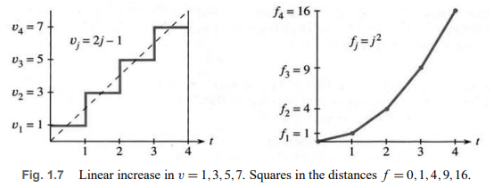
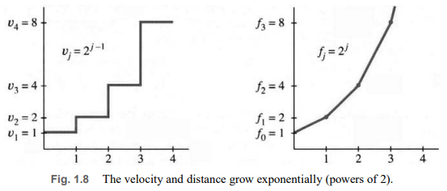
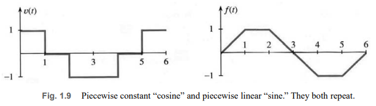
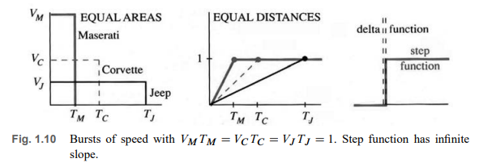
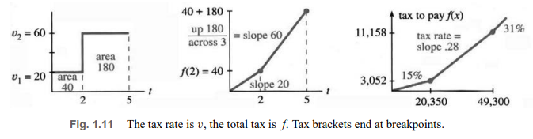

# 📚 Section 1.2: Calculus Without Limits

> **The core idea of calculus revealed through simple numbers—no limits needed yet.**

## 🔢 The Key Insight: Sum of Differences

Start with a list of numbers (think of them as **distances**):
$$
f = [f_0, f_1, f_2, f_3, f_4, f_5] = [0, 2, 6, 7, 4, 9]
$$

Compute the **differences** (think **velocities**):
$$
v = [v_1, v_2, v_3, v_4, v_5] = [2, 4, 1, -3, 5]
$$
where $ v_j = f_j - f_{j-1} $.

Now **sum the differences**:
$$
\sum v_j = 2 + 4 + 1 + (-3) + 5 = 9
$$

Notice:  
$$
\sum v_j = f_5 - f_0 = 9 - 0 = 9
$$

✅ **This is always true!**  
> **The sum of differences equals the last value minus the first value.**  
> All middle terms cancel out:
> $$
> (f_1 - f_0) + (f_2 - f_1) + \cdots + (f_n - f_{n-1}) = f_n - f_0
> $$

This is the **discrete version of the Fundamental Theorem of Calculus**.

---

## 📈 Examples with Graphs (All in One Block)

### Example 1: Linear Growth
$$
f = [2, 3, 4, 5, 6, 7] \quad \Rightarrow \quad v = [1, 1, 1, 1, 1]
$$
- Sum of $ v = 5 = 7 - 2 $
- $ f_j = j + 2 $ → straight line
- $ v_j = 1 $ → constant velocity

### Example 2: Squares (Quadratic)
$$
f = [0, 1, 4, 9, 16] \quad \Rightarrow \quad v = [1, 3, 5, 7]
$$
- These are the **odd numbers**
- Sum: $ 1 + 3 + 5 + 7 = 16 = 4^2 $
- In general: $ \sum_{k=1}^{n} (2k - 1) = n^2 $
- Formula: $ f_j = j^2 $, so $ v_j = f_j - f_{j-1} = j^2 - (j-1)^2 = 2j - 1 $

#### 📊 Graph: Squares and Odd Numbers (Fig. 1.7)

> 💡 **Geometric proof**: The area of the staircase equals the area of a triangle with base $n$ and height $2n$:  
> $$
> \text{Area} = \frac{1}{2} \cdot n \cdot 2n = n^2
> $$

---

### Exponential Growth
$$
f = [1, 2, 4, 8, 16] = [2^0, 2^1, 2^2, 2^3, 2^4]
$$
Differences:
$$
v = [1, 2, 4, 8] = [2^0, 2^1, 2^2, 2^3]
$$
So:
- $ f_j = 2^j $
- $ v_j = f_j - f_{j-1} = 2^j - 2^{j-1} = 2^{j-1} $

#### 📊 Graph: Exponential (Fig. 1.8)

---

### Oscillating Motion
$$
f = [0, 1, 1, 0, -1, -1, 0]
$$
Differences:
$$
v = [1, 0, -1, -1, 0, 1]
$$
- Sum of $ v = 0 = f_6 - f_0 $ → returns to start
- Resembles a **digitized sine wave** ($ f $) and **cosine wave** ($ v $)
- Period = 6

#### 📊 Graph: Oscillation (Fig. 1.9)

---

### Short Burst of Speed
Car moves at speed $ V $ until distance = 1, then stops:
$$
v(t) = 
\begin{cases}
V & \text{if } t \leq T \\
0 & \text{if } t > T
\end{cases}
\quad \text{where } T = \frac{1}{V}
$$
$$
f(t) = 
\begin{cases}
Vt & \text{if } t \leq T \\
1 & \text{if } t > T
\end{cases}
$$

#### 📊 Graph: Burst of Speed (Fig. 1.10)

---

### Real-World Example: Income Tax (1991 Brackets)
Tax is **piecewise linear**; tax rate = **slope**.

**Brackets**:
- $ 0 \leq x \leq 20{,}350 $: rate = 15%
- $ 20{,}350 < x \leq 49{,}300 $: rate = 28%
- $ x > 49{,}300 $: rate = 31%

#### 📊 Graph: Tax Function (Fig. 1.11)

> 💡 **Key analogy**:  
> - **Total tax** ↔ **distance**  
> - **Tax rate** ↔ **velocity**

---

## ✅ Summary: Core Ideas

| Concept | Discrete (This Section) | Continuous (Later) |
|--------|--------------------------|---------------------|
| **Function** | List $ f_0, f_1, \dots $ | Curve $ f(t) $ |
| **Derivative** | Differences $ v_j = f_j - f_{j-1} $ | Slope $ \frac{df}{dt} $ |
| **Integral** | Sum of $ v_j $ | Area under $ v(t) $ |
| **Fundamental Theorem** | $ \sum v_j = f_n - f_0 $ | $ \int_a^b v(t)\,dt = f(b) - f(a) $ |
