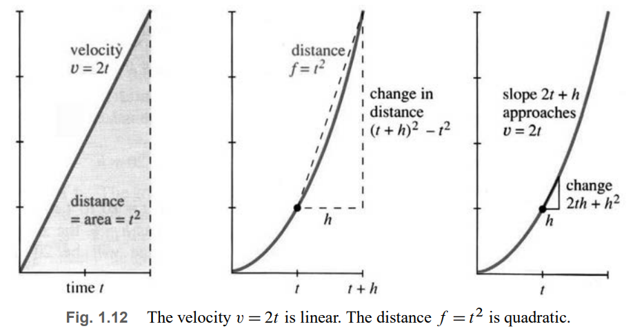
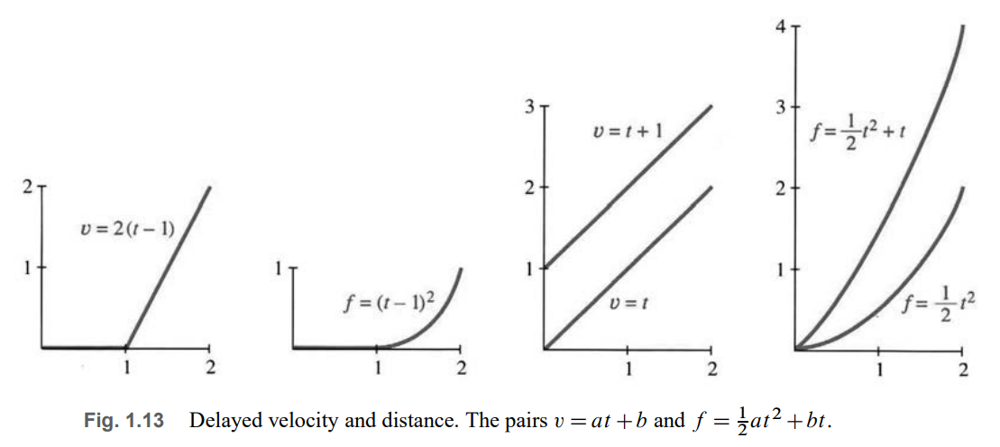
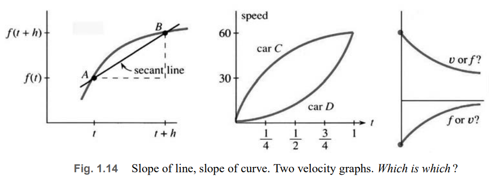

# 📚 Section 1.3: The Velocity at an Instant

> **Calculus meets reality: How do we define speed at a single moment when nothing changes in that instant?**

## 🔁 The Two Central Problems of Calculus

1. **Given velocity $ v(t) $, find distance $ f(t) $** → *Integration*  
2. **Given distance $ f(t) $, find velocity $ v(t) $** → *Differentiation*

These are inverse processes—linked by the **Fundamental Theorem of Calculus**.

---

## 🚗 Example: $ f(t) = t^2 $ → Find $ v(t) $

The graph of $ f(t) = t^2 $ is a **parabola** (Figure 1.12).  
- At $ t = 10 $, $ f = 100 $  
- At $ t = 11 $, $ f = 121 $

**Average velocity** over $[10, 11]$:
$$
v_{\text{avg}} = \frac{f(11) - f(10)}{11 - 10} = \frac{121 - 100}{1} = 21
$$

But this is only an **approximation** to the **instantaneous velocity** at $ t = 10 $.

### Refine the interval:
Over $[10, 10.5]$:
$$
v_{\text{avg}} = \frac{(10.5)^2 - 10^2}{0.5} = \frac{110.25 - 100}{0.5} = 20.5
$$

Over $[10, 10.1]$:
$$
v_{\text{avg}} = \frac{(10.1)^2 - 10^2}{0.1} = \frac{102.01 - 100}{0.1} = 20.1
$$

We see a pattern: **as the time interval shrinks, average velocity approaches 20**.

### General Formula (Algebra + Limit)
Let the time step be $ h $. Then:
$$
v_{\text{avg}} = \frac{f(t + h) - f(t)}{h} = \frac{(t + h)^2 - t^2}{h} = \frac{t^2 + 2th + h^2 - t^2}{h} = 2t + h
$$

Now take the **limit as $ h \to 0 $**:
$$
v(t) = \lim_{h \to 0} (2t + h) = 2t
$$

✅ **Conclusion**:  
- If $ f(t) = t^2 $, then **instantaneous velocity** is $ v(t) = 2t $  
- At $ t = 10 $, $ v = 20 $ → matches the speedometer reading

> This is **differential calculus**: slope of the curve = limit of secant slopes.

---

## 📏 Reverse Problem: $ v(t) = 2t $ → Find $ f(t) $

Now suppose velocity increases linearly: $ v(t) = 2t $.  
What is the total distance?

### Use Geometry (Area Under $ v $-graph)
The graph of $ v(t) = 2t $ is a **straight line** through the origin.  
From $ t = 0 $ to $ t $, the area under the curve is a **triangle**:

- Base = $ t $  
- Height = $ v(t) = 2t $  
- Area = $ \frac{1}{2} \cdot \text{base} \cdot \text{height} = \frac{1}{2} \cdot t \cdot 2t = t^2 $

✅ So $ f(t) = t^2 $

> This is **integral calculus**: distance = area under velocity curve.

---

## 📊 Graph: $ f(t) = t^2 $ and $ v(t) = 2t $ (Fig. 1.12)

---

## 🔄 More Examples

### Example 1: Delayed Start (Fig. 1.13)
Car starts at $ t = 1 $:
$$
v(t) = 
\begin{cases}
0 & t \leq 1 \\
2(t - 1) & t > 1
\end{cases}
\quad,\quad
f(t) = 
\begin{cases}
0 & t \leq 1 \\
(t - 1)^2 & t > 1
\end{cases}
$$

#### Graph: Delayed Motion

    

---

### Example 2: General Acceleration
If acceleration = $ a $ (constant), then:
- $ v(t) = a t $
- $ f(t) = \frac{1}{2} a t^2 $

✅ Famous physics pair:
- Free fall: $ a = g \approx 9.8 \, \text{m/s}^2 $
- $ v(t) = g t $
- $ f(t) = \frac{1}{2} g t^2 $

---

### Example 3: Linear + Quadratic
Let $ f(t) = 3t + t^2 $. Then:
$$
v_{\text{avg}} = \frac{f(t+h) - f(t)}{h} = \frac{3(t+h) + (t+h)^2 - 3t - t^2}{h} = 3 + 2t + h
$$
$$
\Rightarrow v(t) = \lim_{h \to 0} (3 + 2t + h) = 3 + 2t
$$

✅ **Rule**:  
- Constant term in $ f $ → disappears in $ v $  
- Linear term $ ct $ → becomes constant $ c $ in $ v $  
- Quadratic term $ t^2 $ → becomes $ 2t $ in $ v $

---

## 🔍 Secant Lines → Tangent Line (Fig. 1.14)

- **Secant line**: connects two points $ A = (t, f(t)) $ and $ B = (t+h, f(t+h)) $  
- **Slope of secant** = average velocity = $ \frac{f(t+h) - f(t)}{h} $  
- As $ B \to A $ (i.e., $ h \to 0 $), secant → **tangent line**  
- **Slope of tangent** = instantaneous velocity = $ v(t) $

> 📌 **Key insight**:  
> - **Slope** is a **local** property (depends only on behavior near $ t $)  
> - **Area** (distance) is a **global** property (depends on entire history from 0 to $ t $)

---

## 🚙 Two Cars Problem (Fig. 1.14b)

Suppose two velocity graphs:
- **Car C**: constant high speed  
- **Car D**: starts slow, accelerates

**Questions**:
1. Who is faster at $ t = 3/4 $? → **Car C** (higher $ v $)  
2. Is D catching up at $ t = 1 $? → **Yes**, if D’s speed eventually exceeds C’s  
3. Between $ t = 1/2 $ and $ t = 1 $, do they get closer? → Only if D’s speed > C’s during that interval

> 💡 To answer, **imagine the distance graphs**:  
> - Steeper $ v $ → faster-growing $ f $  
> - Area under $ v $ = total distance

---

## ✅ Summary: Key Ideas

| Concept | Formula | Meaning |
|--------|--------|--------|
| **Average velocity** | $ \dfrac{f(t+h) - f(t)}{h} $ | Slope of secant line |
| **Instantaneous velocity** | $ v(t) = \lim_{h \to 0} \dfrac{f(t+h) - f(t)}{h} $ | Slope of tangent = derivative |
| **Distance from velocity** | $ f(t) = \int_0^t v(s)\,ds $ | Area under $ v $-graph |
| **Example** | $ f(t) = t^2 \Rightarrow v(t) = 2t $ | Parabola → line |
| **Reverse** | $ v(t) = 2t \Rightarrow f(t) = t^2 $ | Triangle area = $ t^2 $ |

> **Calculus is not magic—it’s the art of passing to the limit.**  
> From **average** to **instantaneous**, from **secant** to **tangent**, from **algebra** to **analysis**.