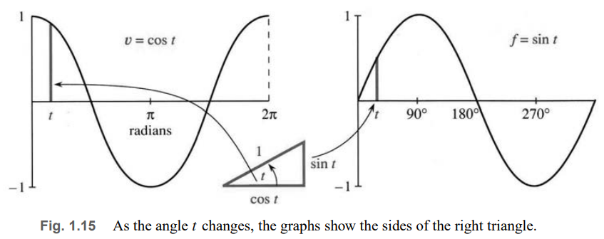
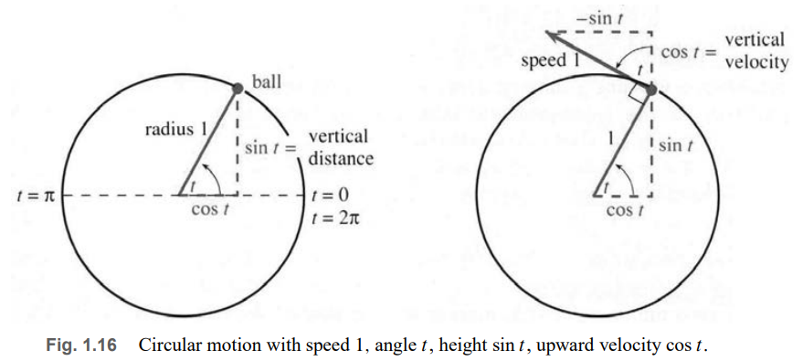
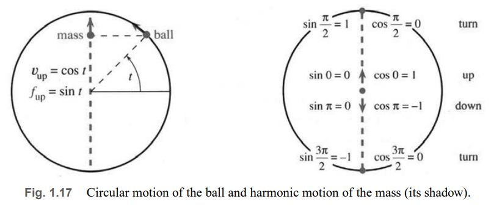
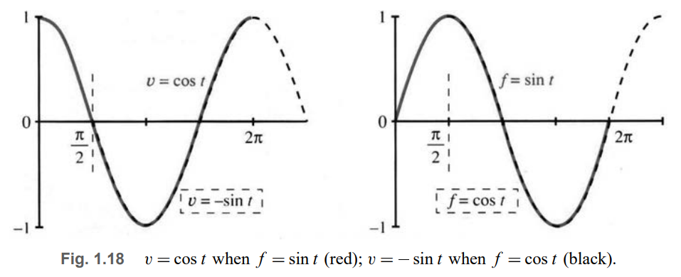

# 📚 Section 1.4: Circular Motion

> **Trigonometry meets calculus: How do we find the slope of sine and cosine curves?**

## 🔁 The Big Idea: Sine & Cosine from Rotation

We use **circular motion** to define sine and cosine:
- A ball moves counterclockwise around a circle of radius 1.
- At time $ t $, its angle from the positive x-axis is $ t $ radians.
- Its position:  
  $$
  x = \cos t, \quad y = \sin t
  $$
- Pythagoras’ identity:  
  $$
  \cos^2 t + \sin^2 t = 1
  $$

✅ **Why radians?**  
- Full circle = $ 2\pi $ radians (not 360°) → speed = 1 when angle = time.
- Speed in degrees would be $ \approx 0.01745 $ — messy!

---

## 📐 Position Triangle (Fig. 1.15)

At any time $ t $:
- **Horizontal position** = $ \cos t $
- **Vertical position** = $ \sin t $

Key points:
- $ t = 0 $: $ (\cos 0, \sin 0) = (1, 0) $ → starts on x-axis
- $ t = \pi/2 $: $ (0, 1) $ → top of circle
- $ t = \pi $: $ (-1, 0) $ → leftmost point
- $ t = 2\pi $: back to $ (1, 0) $

---

## 🌀 Velocity of the Ball (Fig. 1.16)

The ball moves with constant speed 1 along the circle.  
Its velocity vector is **tangent** to the circle — perpendicular to the position vector.

### Velocity Components:

From geometry (rotated 90° triangle):

- **Upward velocity** = $ \cos t $  
- **Horizontal velocity** = $ -\sin t $

✅ So velocity vector:  
$$
\vec{v}(t) = \langle -\sin t, \cos t \rangle
$$

#### Why?
- At $ t = 0 $: moving straight up → velocity = $ \langle 0, 1 \rangle $ → matches $ \cos 0 = 1 $
- At $ t = \pi/2 $: at top → moving left → velocity = $ \langle -1, 0 \rangle $ → matches $ -\sin(\pi/2) = -1 $
- At $ t = \pi $: moving down → velocity = $ \langle 0, -1 \rangle $ → matches $ \cos \pi = -1 $

---

## 🎯 Oscillation: The Shadow of the Ball (Fig. 1.17)

Instead of circular motion, imagine a mass moving **up and down** on the y-axis — it’s the **shadow** of the ball.

- Height of mass = height of ball = $ f(t) = \sin t $
- Velocity of mass = vertical component of ball’s velocity = $ v(t) = \cos t $

✅ **Simple Harmonic Motion**:
- Distance: $ f(t) = \sin t $
- Velocity: $ v(t) = \cos t $
- Acceleration: $ a(t) = -\sin t $ (derivative of cos t)

This is smooth oscillation — unlike “bang-bang” motion with sudden jumps.

---

## 📈 Slope of the Sine Curve (Fig. 1.18)

We now answer: **What is the slope of $ f(t) = \sin t $?**

From above:  
> **The slope of $ \sin t $ is $ \cos t $.**

✅ Key observations:
- At $ t = 0 $: slope = $ \cos 0 = 1 $ → curve rising fastest
- At $ t = \pi/2 $: slope = $ \cos(\pi/2) = 0 $ → flat (maximum)
- At $ t = \pi $: slope = $ \cos \pi = -1 $ → falling fastest
- At $ t = 3\pi/2 $: slope = 0 → flat (minimum)

---

## 🔄 Slope of the Cosine Curve

If we start the clock at the top ($ t = 0 $ when ball is at (0,1)), then:

- Position: $ f(t) = \cos t $
- Velocity: $ v(t) = -\sin t $

✅ So:  
> **The slope of $ \cos t $ is $ -\sin t $.**

This is the “twin pair” of sine/cosine:
- $ \frac{d}{dt}(\sin t) = \cos t $
- $ \frac{d}{dt}(\cos t) = -\sin t $

---

## 🚀 Faster Motion: Angle = 2t

Suppose the ball goes twice as fast → angle = $ 2t $ at time $ t $.

Then:
- Position: $ x = \cos 2t $, $ y = \sin 2t $
- Velocity:  
  $$
  \vec{v}(t) = \langle -2\sin 2t, 2\cos 2t \rangle
  $$
- Speed = 2 (magnitude of velocity vector)

✅ General rule:  
If position = $ \sin(kt) $, then velocity = $ k \cos(kt) $  
If position = $ \cos(kt) $, then velocity = $ -k \sin(kt) $

---

## 📊 Area Under Cosine Curve (Fundamental Theorem!)

Question: What is the area under $ v(t) = \cos t $ from $ t = 0 $ to $ t = \pi/2 $?

Answer:  
Since $ \frac{d}{dt}(\sin t) = \cos t $, by the Fundamental Theorem:  
$$
\int_0^{\pi/2} \cos t \, dt = \sin(\pi/2) - \sin(0) = 1 - 0 = 1
$$

✅ **Power of calculus**: You don’t need geometry — just know the antiderivative!

---

## 🧠 Summary: Key Pairs

| Distance $ f(t) $ | Velocity $ v(t) $ | Meaning |
|--------------------|---------------------|---------|
| $ f(t) = t $      | $ v(t) = 1 $       | Constant speed |
| $ f(t) = \frac{1}{2}at^2 $ | $ v(t) = at $ | Constant acceleration |
| $ f(t) = \sin t $ | $ v(t) = \cos t $ | Simple harmonic motion (up/down) |
| $ f(t) = \cos t $ | $ v(t) = -\sin t $ | Simple harmonic motion (left/right) |

> 💡 **Calculus connects position and velocity through derivatives and integrals — even for waves!**

---

## 📌 Core Concepts Recap

- **Velocity = slope of position curve**
- **Slope of sine = cosine**
- **Slope of cosine = negative sine**
- **Circular motion → trig functions → derivatives**
- **Harmonic motion = shadow of circular motion**
- **Area under velocity = change in position**

> **Calculus is not abstract — it describes real motion: planets, springs, sound waves, AC circuits.**

---

## ✅ Final Thought

> **“The most important thing is not to stop questioning.” — Einstein**

Calculus began with questions about motion — and it continues to answer them, from planetary orbits to quantum waves. You’ve now seen **three fundamental pairs**:
1. Linear: $ f = vt $, $ v = \text{constant} $
2. Quadratic: $ f = \frac{1}{2}at^2 $, $ v = at $
3. Trigonometric: $ f = \sin t $, $ v = \cos t $