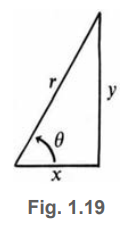

# 📚 Section 1.5: A Review of Trigonometry

> **Trigonometry begins with a right triangle — but calculus needs the circle.**

## 🔺 The Six Trig Functions

In a right triangle with angle $ \theta $, hypotenuse $ r $, adjacent side $ x $, opposite side $ y $:

| Function | Ratio | Definition |
|----------|-------|------------|
| $ \cos \theta $ | $ \dfrac{x}{r} $ | adjacent / hypotenuse |
| $ \sin \theta $ | $ \dfrac{y}{r} $ | opposite / hypotenuse |
| $ \tan \theta $ | $ \dfrac{y}{x} $ | opposite / adjacent |
| $ \sec \theta $ | $ \dfrac{r}{x} = \dfrac{1}{\cos \theta} $ | reciprocal of cosine |
| $ \csc \theta $ | $ \dfrac{r}{y} = \dfrac{1}{\sin \theta} $ | reciprocal of sine |
| $ \cot \theta $ | $ \dfrac{x}{y} = \dfrac{1}{\tan \theta} $ | reciprocal of tangent |

✅ **Key identity**:  
$$
\tan \theta = \frac{\sin \theta}{\cos \theta}
$$

> 💡 “Tangent” has three meanings:  
> - Tangent of an angle → ratio $ y/x $  
> - Tangent to a circle → line touching at one point  
> - Tangent line to a graph → slope at a point

[FIG 1.19: Right triangle labeled with sides x, y, r; angles θ; six trig ratios defined]

---

## 🔄 Moving from Triangles to Circles (Fig. 1.20)

Triangles work for $ 0^\circ < \theta < 180^\circ $, but not beyond. So we switch to the **unit circle** (radius = 1).

- Angle $ \theta $ measured counterclockwise from positive x-axis.
- Point on circle: $ (\cos \theta, \sin \theta) $
- Full circle = $ 360^\circ = 2\pi $ radians → so $ 1^\circ = \frac{2\pi}{360} \approx 0.01745 $ rad

✅ **Why radians?**  
- Distance along arc = radius × angle → when r=1, distance = θ  
- Speed = 1 when angle = time → clean math!

### Negative Angles:
- Clockwise angles are negative: $ -\theta $ → point is below x-axis
- Cosine is **even**: $ \cos(-\theta) = \cos \theta $
- Sine and tangent are **odd**:  
  $$
  \sin(-\theta) = -\sin \theta, \quad \tan(-\theta) = -\tan \theta
  $$

### Periodicity:
All six functions repeat every $ 2\pi $ radians:  
$$
\sin(\theta + 2\pi) = \sin \theta, \quad \cos(\theta + 2\pi) = \cos \theta, \dots
$$

[FIG 1.20: Unit circle with angles 0°, 90°, 180°, 270°, 360°; points labeled with cos/sin values; graphs of sin θ, cos θ, tan θ showing periods]

---

## 📐 Example: $ \theta = \frac{2\pi}{3} $ (or $ -\frac{4\pi}{3} $)

This angle is in second quadrant → x negative, y positive.

With $ r = 1 $:
- $ \cos \theta = x = -\frac{1}{2} $
- $ \sin \theta = y = \frac{\sqrt{3}}{2} $
- $ \tan \theta = \frac{y}{x} = -\sqrt{3} $
- $ \sec \theta = \frac{1}{\cos \theta} = -2 $
- $ \csc \theta = \frac{1}{\sin \theta} = \frac{2}{\sqrt{3}} $
- $ \cot \theta = \frac{1}{\tan \theta} = -\frac{1}{\sqrt{3}} $

✅ **Size bounds**:
- $ |\cos \theta| \leq 1 $, $ |\sin \theta| \leq 1 $
- $ |\sec \theta| \geq 1 $, $ |\csc \theta| \geq 1 $
- $ \tan \theta $ and $ \cot \theta $ can be any real number

---

## 🧮 Key Identities (Pythagorean Triples)

From $ x^2 + y^2 = r^2 $, divide by $ r^2 $, $ x^2 $, or $ y^2 $:

1. $ \cos^2 \theta + \sin^2 \theta = 1 $
2. $ 1 + \tan^2 \theta = \sec^2 \theta $
3. $ \cot^2 \theta + 1 = \csc^2 \theta $

✅ These are the **three pillars** of trigonometry.

---

## 📏 Distance Formula & Addition Formulas (Fig. 1.21)

### Distance between two points:
If points are $ (x_1, y_1) $ and $ (x_2, y_2) $, then:
$$
d = \sqrt{(x_2 - x_1)^2 + (y_2 - y_1)^2}
$$

### Cosine of Difference (Fig. 1.21b, c):

Use two points on unit circle: $ (\cos s, \sin s) $ and $ (\cos t, \sin t) $.  
Distance squared:
$$
d^2 = (\cos s - \cos t)^2 + (\sin s - \sin t)^2
$$

Same distance if we rotate: point $ (\cos(s-t), \sin(s-t)) $ and $ (1, 0) $:
$$
d^2 = (\cos(s-t) - 1)^2 + (\sin(s-t))^2
$$

Set equal and simplify:
$$
\cos(s - t) = \cos s \cos t + \sin s \sin t \tag{4}
$$

✅ **Addition formula**:
$$
\cos(s + t) = \cos s \cos t - \sin s \sin t \tag{5}
$$

✅ **Double angle**:
$$
\cos(2t) = \cos^2 t - \sin^2 t = 2\cos^2 t - 1 = 1 - 2\sin^2 t \tag{6}
$$

[FIG 1.21a: Two points on plane; right triangle formed; distance formula]  
[FIG 1.21b: Two points on unit circle; distance between them]  
[FIG 1.21c: Same circle, rotated; distance same → derive cos(s-t)]

---

## 📈 Sine Addition Formulas

Use complementary angle:  
$$
\sin \theta = \cos\left(\frac{\pi}{2} - \theta\right), \quad \cos \theta = \sin\left(\frac{\pi}{2} - \theta\right)
$$

Apply to cosine formulas:

✅ **Sine difference**:
$$
\sin(s - t) = \sin s \cos t - \cos s \sin t \tag{8}
$$

✅ **Sine sum**:
$$
\sin(s + t) = \sin s \cos t + \cos s \sin t \tag{9}
$$

✅ **Double angle for sine**:
$$
\sin(2t) = 2 \sin t \cos t \tag{10}
$$

---

## 📊 Summary: The Ten Essential Formulas

| Type | Formula |
|------|---------|
| Pythagorean | $ \cos^2 \theta + \sin^2 \theta = 1 $ |
| Pythagorean | $ 1 + \tan^2 \theta = \sec^2 \theta $ |
| Pythagorean | $ \cot^2 \theta + 1 = \csc^2 \theta $ |
| Cosine diff | $ \cos(s - t) = \cos s \cos t + \sin s \sin t $ |
| Cosine sum | $ \cos(s + t) = \cos s \cos t - \sin s \sin t $ |
| Cosine double | $ \cos(2t) = \cos^2 t - \sin^2 t $ |
| Sine diff | $ \sin(s - t) = \sin s \cos t - \cos s \sin t $ |
| Sine sum | $ \sin(s + t) = \sin s \cos t + \cos s \sin t $ |
| Sine double | $ \sin(2t) = 2 \sin t \cos t $ |
| Complementary | $ \sin \theta = \cos(\frac{\pi}{2} - \theta) $ |

[FIG 1.22: Diagram showing how these formulas apply to specific angles like π/6, π/3, 5π/6]

---

## ✅ Why This Matters for Calculus

These identities are **not optional** — they are essential for:
- Finding derivatives of sin and cos (Chapter 2)
- Computing integrals involving trig functions (Chapter 5)
- Understanding oscillations, waves, AC circuits, vibrations

> 💡 **The essence of calculus** often appears in limits like:  
> $$
> \lim_{\theta \to 0} \frac{\sin \theta}{\theta} = 1
> $$
> — which relies on these identities.

---

## 🖼️ Figure Placeholders (Replace with Images)

You can insert actual images here:

- `[FIG 1.19]` → Right triangle with labels for sin, cos, tan, etc.
- `[FIG 1.20]` → Unit circle with key angles (0, π/2, π, 3π/2, 2π); graphs of sin, cos, tan
- `[FIG 1.21a]` → Distance formula between two points
- `[FIG 1.21b]` → Two points on unit circle → distance → derive cos(s-t)
- `[FIG 1.21c]` → Rotated view → same distance → confirm formula
- `[FIG 1.22]` → Application of formulas to π/6, π/3, 5π/6

---

## 🎯 Final Thought

> **“Trigonometry is not about memorizing formulas — it’s about understanding relationships.”**

You now have the tools to:
- Define sine/cosine from circles
- Compute all six trig functions
- Use Pythagorean identities
- Apply addition and double-angle formulas

These will be your foundation for **differentiating and integrating trig functions** — the heart of calculus applications in physics, engineering, and signal processing.

Let’s move forward — the derivative of sin t is waiting!